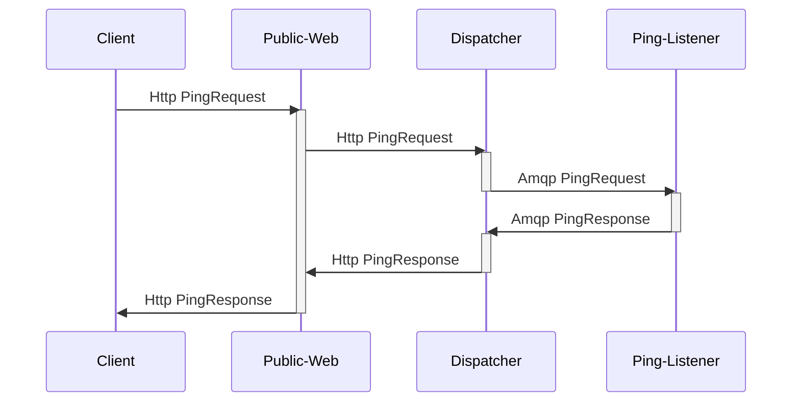

# Dispatcher Research

## About this project

This was originally a project intended to explore dividing up an application into three tiers:

- public facing web api
- dispatcher for moving data between the web api and the backend
- backend event listeners to perform business operations

This is a rather simple form. The three tiers exist but the only operation being performed is a simple ping operation.

During the development of these pieces I found debugging across the different services to be painful. I wanted to be able to centralize logs to a single platform where I could quickly query for a single event to see what was occurring. This lead to building out a Grafana stack to utilize Loki and Tempo for tracing requests across the stack.

Everything is using OpenTelemetry for tracking. Haven't setup any kind of metrics yet. So in theory, it should be possible to swap out Grafana for another OpenTelemetry consumer.

## Using

This project is setup to run within a DevContainer and launches multiple Docker containers. 

Upon first running the DevContainer, run `npm ci` within the root project. Once this is completed, run `bin/restart.sh`. This will build the common lib and restart the Docker containers running the three services.

To generate a request, run `node bin/req.mjs`. This will run a ping request through the service.

Grafana can be found at [http://localhost:3000](http://localhost:3000). At this time, there are no configured dashboards, but the data explorer is preconfigured for Tempo and Loki. Within Tempo searching for `{}` will show all traces performed by running the previously mentioned `req.mjs`. Logs can be accessed through the Loki data source, or by clicking the show logs link on each span within Tempo.

**Note**: There is an issue with the start order of the services that I haven't gotten around to resolving. Upon restarting the DevContainer running `bin/restart.sh` should resolve any issues.

## Program Flow

## Components

### Public-Web

The purpose of this component is to minimize the role of the public gateway.

At present it accepts connections and immediately forwards on the request to the dispatcher. It does not hold the connection open to the dispatcher, instead stores a `Promise` in a table to be resolved when the dispatcher calls in with a response the public-web's own `/dispatch` endpoint. The goal here is to allow the dispatch layer to be scaled independently of the public-web component.

#### Future Experiments

- Persistant Websocket connections between client and public-web
- Ability to register a webhook to receive responses opposed to the client connection
- Ability to register to receive events based on rules rather than a single id column

### Dispatcher

The Dispatcher is intended to listen to all events from one or more sources and route the event to the appropriate service.

### Ping-Listener

This is a simple AMQP listener which receives a ping request and creates a ping response including the time it received the request.

## Grafana Stack Setup

### Challenges

- Must load instrumentation modules prior to the libraries they instrument
- Loki log querying reported quite a few errors. This lead to using MinIO for log storage. Unfortunately at the moment MinIO requires some manual setup. Will either fix that or try to go back to local storage.

### MinIO Setup

The MinIO by default is on port 9001 and can be accessed via [http://localhost:9001](http://localhost:9001/). It's setup with the following credentials:

- **Username**: `minio`
- Password: `secret-secret`

Need to add the following **buckets**:

- loki
- mimir
- tempo

Tempo also requires a key at the moment as well.

Create an **Access Key** with the following:

- **Access Key**: `tempo`
- **Secret Key**: `secret-secret`

Obviously, I went for *really* secure here. Once these have been added, you will need to restart the following containers:

- loki
- mimir
- tempo

Provided you do not delete any of the docker volumes, this should only need to be done once.
